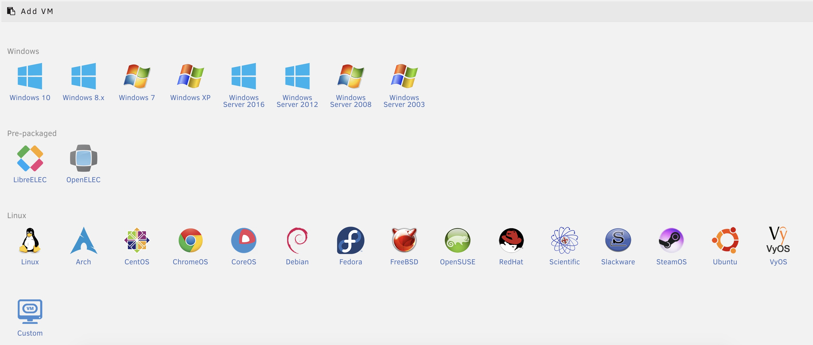
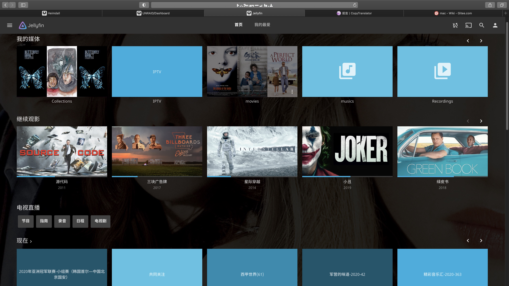
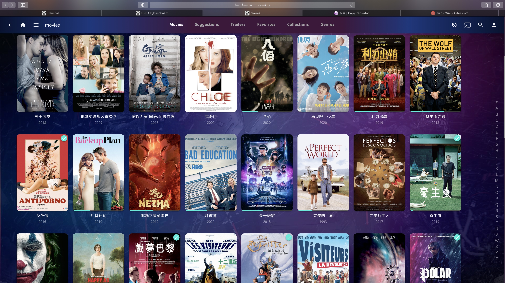
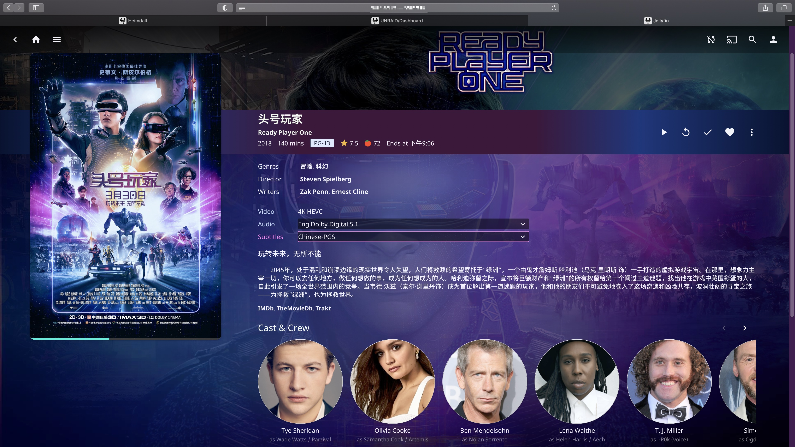
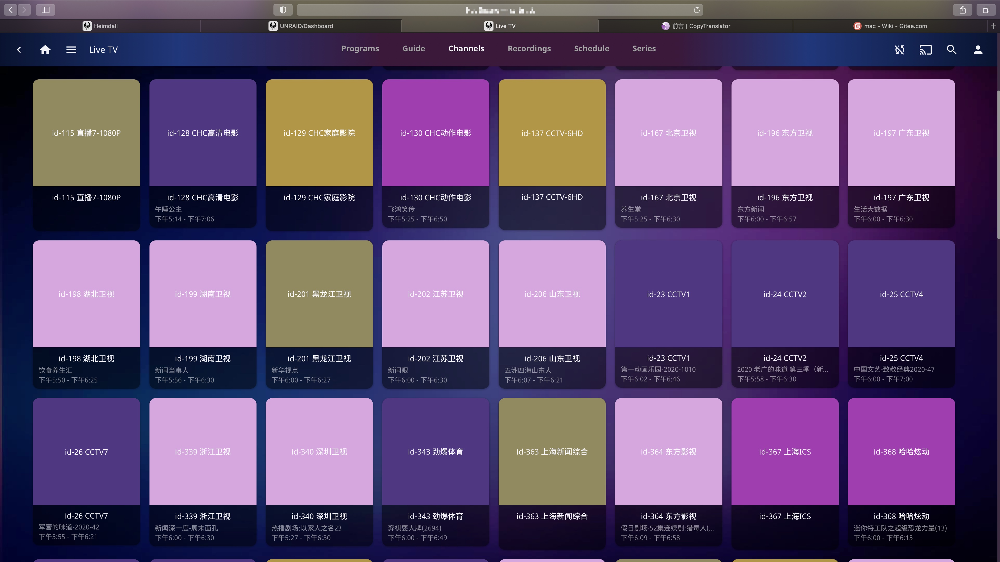
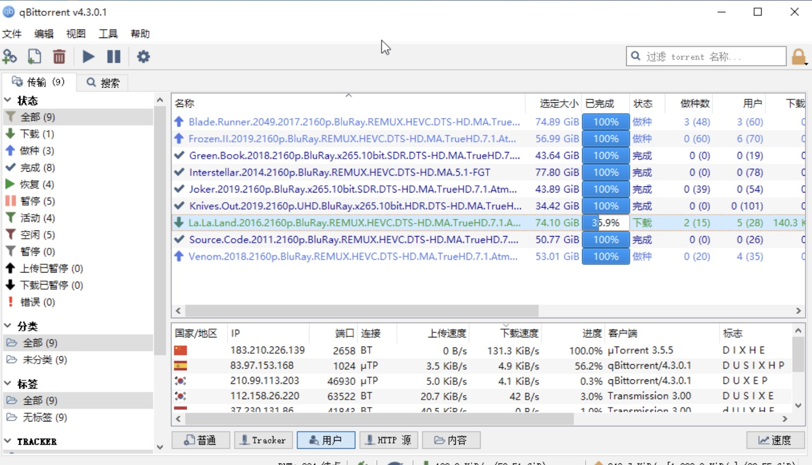
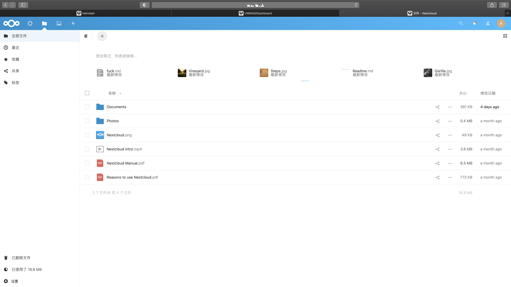
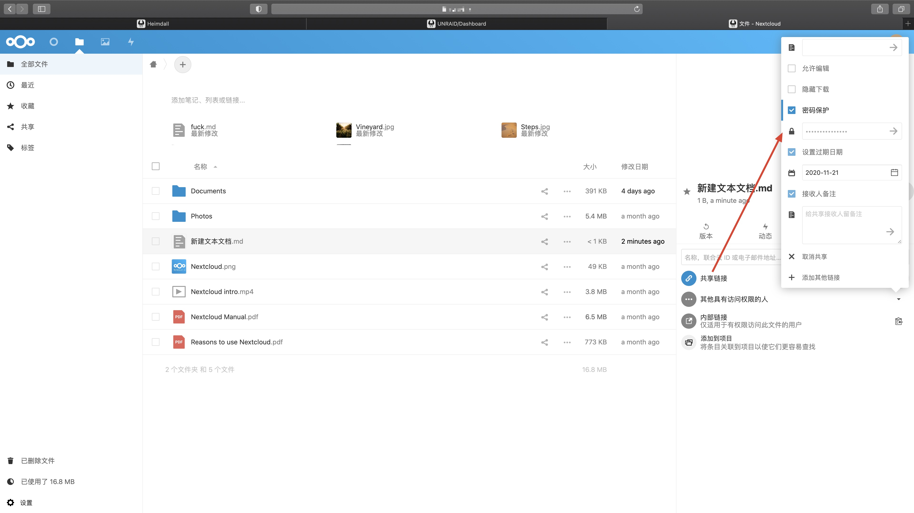
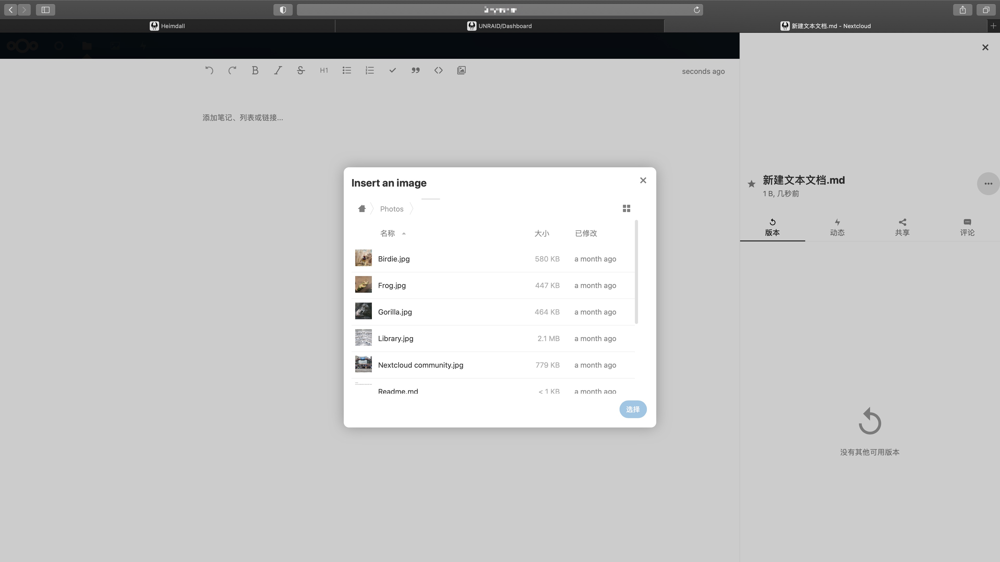

<h1 align="center">All In One 家庭服务器主机</h1>

结合低功耗x86主机，再借助Unraid虚拟机系统搭建家庭服务器。Unraid概要介绍：[满足所有需求的千元级AIO Nas服务器，实时转码4K H265 10bit](https://www.bilibili.com/video/BV1nE41187fr)，视频第10分钟开始介绍，主要是支持装docker容器、虚拟机，unraid上的虚拟机和docker镜像支持硬件直通（支持网卡、声卡、核显、独显等），由于有了硬件直通（硬件屏蔽隔离），因此虚拟机性能更接近物理机（约90%~97%）。硬件配置清单在最后列出！

- unraid支持的常见虚拟机模板如下：
  

- docker是更轻量化的虚拟机服务，现在主流是作为微服务来应用，从2015年开始在国内爆发。
- Unraid **原生支持** Raid5 级别的数据安全，即可以添加校验盘进一步保障数据安全。

## 目标

1. **家庭数据中心**私有云（安装部署NextCloud等同类型的docker镜像）——大小取决于装了多大硬盘，后期随意升级，上传下载速度取决于你的带宽（目前国内三大运营商手机套餐移动88元/电信联通99~100多元——赠送的宽带下行100Mb/s=12.5MB/s，上行50Mb/s=6.25MB/s），在线网络硬盘可在线编辑（SMB/NFS协议的分享与挂载），实时同步文档（安装部署Synchthing的docker镜像）、私人网盘（安装部署nextcloud的docker镜像）、私有代码仓库（安装部署gitserver的docker镜像）、博客服务器（安装部署WordPress等等博客镜像）；省去随身携带的u盘、硬盘，以及解决手机电脑存储不够用的麻烦。
2. **多媒体中心**（安装部署Jellyfin/Emby/Plex的docker镜像）：实时4k高码率硬件解码+推流，客户端（安卓、ios、windows、Mac）随时查看私有云里面的音视频，只要有浏览器和网络均可播放。没有网络情况下，局域网内，可推送音视频到任何一台设备；
3. **下载器**（安装部署qBittorrent/Aria2/Transmission的docker镜像）可根据链接、种子远程操控家庭服务器挂载下载任务，一地下载随时随地多设备访问。
4. **高性能软路由**：OpenWrt、爱快、Lede等配合科学上网，实现高速访问外网，可实时观看油管/Plex 4k60Hz 视频。
5. **docker hub**集成大家的智慧结晶，里面有各种各样有趣镜像，比如自动备份iCloud的镜像。
6. **HTTPS证书自动续约和反向代理**：[UNRAID基于NginxProxyManager与ACME实现https访问与免费证书自动更新](https://post.smzdm.com/p/a6lron8z/)
7. 还可以安装**黑苹果**虚拟机，直通显卡网卡性能接近物理计。
8. 
**注**：还可以设置多用户多权限管理，体验取决于同一时间使用的用户数以及带宽的上行速度。由于需要**集成显卡**，因此不入手二手志强CPU，以及服务器主板。

## 图片展示

### Jellyfin——从Emby分裂出来的开源多媒体播放器  

### qB共享下载器

### NextCloud 开源的私有网盘

#### 设置分享细节

#### 在线编辑MarkDown文本，直接引用网盘的图片

## 硬件配置

| 项目   | 型号                                                         | 价格，单位：元 购买日期：2020.09.17                      |
| :----- | :----------------------------------------------------------- | ------------------------------------------------------------ |
| CPU    | G5620 TDP: 54W 2c4t 基频:4GHz UHD630：4k h265解码 码率可达120Mbps 流畅播放，根据黑苹果使用经验，UHD630的接口可以以两个4k 60Hz输出到2个屏幕！ **备选方案**：G6400 性能一样， 价格一样，区别1200接口，散片与上价格一样。 **使用反馈**：日常待机，12%左右的CPU负载，高速下载的时候比较占用CPU（Unraid官方未优化），建议买张性能比较好的多网口网卡，这样既满足软路由的需要又不占用CPU资源！单个客户端实时转码推送1080p 10Mbps视频，此时约25~30%CPU负载。4k h265(即HEVC) 10Bit视频（需要配置花费>4k￥以上的10Bit面板的显示器）建议在局域网内以2160p 120Mbps码率享受，远程播放4k高码率的时候家用带宽带成为瓶颈，4k h265(即HEVC) 10Bit视频实时解码客户端以1080p播放占用CPU 50%~90%CPU负载（开启集显硬解码的前提下，Jellyfin优化不够好）。 | 345 散片                                                     |
| 主板   | MSI B360m 迫击炮——1151接口日后可升级8/9代性能更高的CPU, Sata3: 4个硬盘位；PCIEx1 2个口 可扩展万兆网口和磁盘阵列卡 以及 PCIEx16 2个口：可扩展eGPU；2个m2插槽，注意：第二个m2与第二个PCIEx16冲突；优点：如果日后想黑苹果，github上完善的EFI很多。 **备选方案**：MSI B460m 迫击炮 与b360迫击炮优点点：2.5G有线网卡，1200接口，兼容下一代处理器，如果日后黑苹果，github上完善的EFI很多；缺点：价格770元。 **注意**：主板不买二手，因为7x24小时不间断工作，二手主板怕电容老旧和缺陷，比如电压不稳进而不久就损坏甚至造成起火爆炸，殃及硬盘数据，因此这一块不想冒险。 | JD全新550（二手350元，咸鱼未拆封：480元），申请价格保护：500元，历史最低价。 |
| 内存   | 光威奕pro DDR4 8g 2666/3000 单条，毕竟NAS性能不挑，只要够大  | 拼多多百亿补贴：160全新                                      |
| 固态   | Sata3 240g作为机械硬盘缓存盘，提高体验； **升级体验**：m2协议固态，这样提升日常访问网络硬盘当中小文件的速度，比如office三件套、markdown文档、配置文件等等。 | ~~150 京东全新~~（已有）                                     |
| 网卡   | 主板自带有线网卡； **升级体验**：PCIEx1 转 4口千兆或者双口万兆。 | --                                                           |
| 机箱   | [gamemax游戏帝国爆破者机箱](https://detail.tmall.com/item.htm?spm=a230r.1.14.16.7509e111jXKITZ&id=542612838142&ns=1&abbucket=8)，自带4个3.5、2个2.5盘位，光驱位可扩展2个3.5寸盘位，总共：6个3.5寸硬盘盘位+2个2.5寸盘位+主板自带双m2插槽，家庭使用够用了。 | 150 全新顺丰包邮                                             |
| 电源   | 鑫谷（Segotep）额定500W GP600G黑金全模组电源，5年质保； **注意**： 由于7x24小时不间断工作，所以尽量买好的电源，防止供电不稳损坏硬盘甚至造成主板爆炸，进而殃及池鱼，最后数据丢失，因此这一块不想冒险。 | 360 全新                                                     |
| 散热   | intel cpu原装风扇 + 1个风扇 **散热情况**：CPU拷机10分钟，未高过75度，nas主机日常功耗更低，完全够用。 | 15 + 10                                                      |
| 数据线 | 山泽 SATA3 数据线 9元 2个 **注意**：由于硬盘7x24小时不间断工作，防止数据线品质不好，比如电压不稳造成硬盘损坏，进而丢失数据，因此这一块不想冒险。 | 18                                                           |
| 总计   |                                                              | 1557                                                         |

## 远程访问方案

**非移动宽带**

1. 向运营商申请公网ip
2. 申请**免费顶级域名** 比如 .tk .ru .mu后缀的域名
3. 利用阿里云 或者 腾讯云（DNSPod被腾讯收购了）的 api 在Unraid上下载对应DDNS的docker镜像，配置部署以后**免费实现动态域名解析**，阿里在apps搜索aliyun-ddns, 腾讯云搜索dnspod-ddns就能找到对应的ddns服务，不需要花生壳ddns服务和它乱七八糟的域名。

